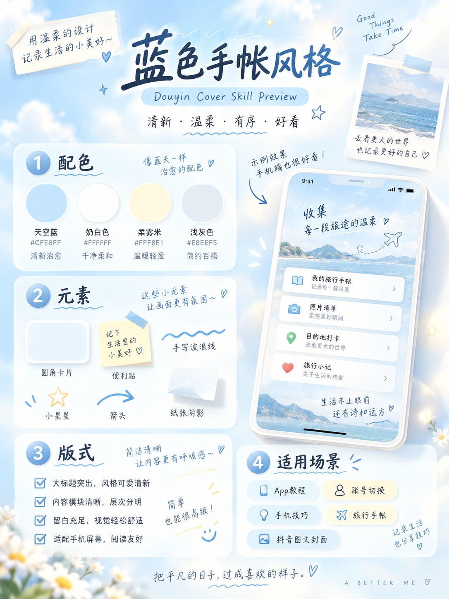
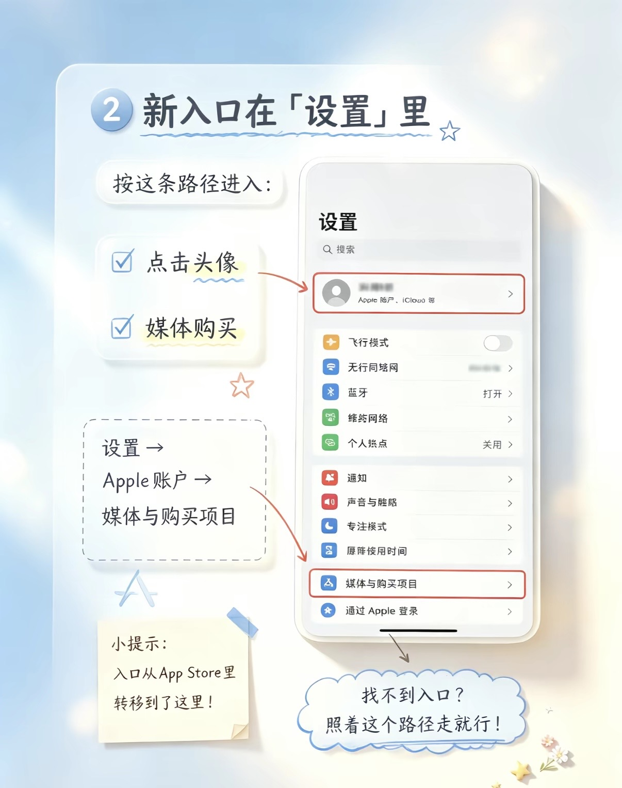

# 下周七 · 蓝色手帐 Skill

一套用于手机教程图、知识卡片与抖音图文封面的轻手帐视觉规范。

它以雾蓝、奶白为主色，用少量纸张、便签、手写线条和柔光建立层次。重点不是堆装饰，而是让画面清透、信息清楚、在手机上舒服耐看。

## 可以用来做什么

- 抖音、小红书等平台的 3:4 竖版图文封面
- iPhone、App、账号设置类教程信息图
- 操作步骤卡与轻知识整理图
- 旅行手帐信息页与生活记录卡片

它的固定视觉结构是：圆角纸卡 + 手机截图或信息模块 + 少量手写标记。旅行照片可以出现在拍立得、手机界面或小型手帐插图里，但普通照片加标题不属于这套风格。

## 示例图片

### 定稿总览｜蓝色手帐完整视觉语言



### 参考图 01｜教程封面与标题层级


### 参考图 02｜步骤卡与手机界面排版



这 3 张共同确定了雾蓝奶白、手写标记、圆角纸卡、手机主视觉和移动端信息层级，均作为正式风格参考。

## 调用方式

可以直接说：

> 使用「下周七 · 蓝色手帐」把这张图做成 3:4 抖音封面。

也可以补充具体模式：

> 用蓝色手帐风格排一张 iPhone 教程图，保留截图里的真实路径。

## 文件结构

```text
xiazhouqi-blue-journal-skill/
├─ SKILL.md
├─ README.md
├─ agents/
│  └─ openai.yaml
├─ references/
│  └─ style-guide.md
└─ examples/
   ├─ reference-app-store-cover.jpeg
   ├─ reference-settings-path.jpeg
   └─ blue-journal-style-preview.jpeg
```

## 设计原则

完整规则见 [`references/style-guide.md`](references/style-guide.md)。

最短定义：

> 雾蓝奶白的清透底色 + 轻手帐细节 + 明确的信息层级 + 手机端友好的教程排版。
