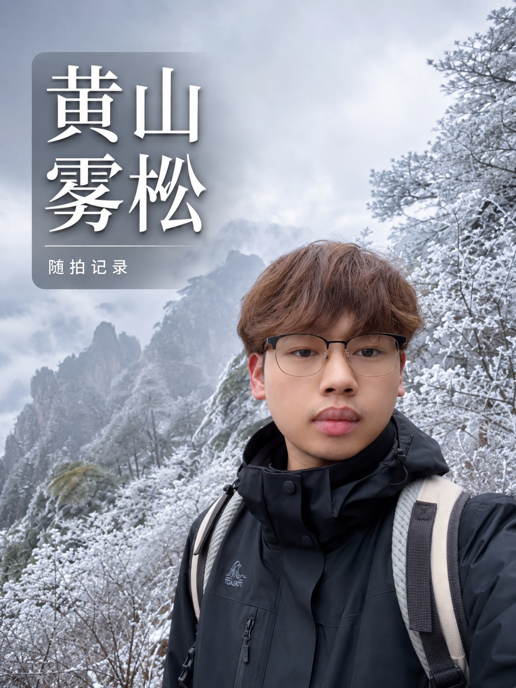

# 下周七 · 蓝色手帐 Skill

一套用于手机教程图、知识卡片与旅行照片封面的轻手帐视觉规范。

它以雾蓝、奶白为主色，用少量纸张、便签、手写线条和柔光建立层次。重点不是堆装饰，而是让画面清透、信息清楚、在手机上舒服耐看。

## 可以用来做什么

- 抖音、小红书等平台的 3:4 竖版图文封面
- iPhone、App、账号设置类教程信息图
- 操作步骤卡与轻知识整理图
- 旅行照片封面、地点记录与人物随拍

默认分为两种模式：

| 模式 | 适合内容 | 核心做法 |
| --- | --- | --- |
| 信息手帐 | 手机教程、App 路径、步骤说明 | 圆角纸卡 + 主截图 + 少量手写标记 |
| 旅行照片 | 人物旅行照、风景照、随拍封面 | 照片全幅 + 克制标题卡 + 自然调色 |

## 示例图片

### 参考图 01｜教程封面与标题层级


### 参考图 02｜步骤卡与手机界面排版


### 成品示例｜旅行照片封面



前两张用于确定雾蓝奶白、手写标记、圆角纸卡等核心语言；第三张展示这套风格应用到真实旅行照片时应有的克制感。

## 调用方式

可以直接说：

> 使用「下周七 · 蓝色手帐」把这张图做成 3:4 抖音封面。

也可以补充具体模式：

> 用蓝色手帐的信息手帐模式排一张 iPhone 教程图，保留截图里的真实路径。

> 用蓝色手帐的旅行照片模式处理这张照片，不加“小岛周末”，肤色自然一点。

## 文件结构

```text
xiazhouqi-blue-journal-skill/
├─ SKILL.md
├─ README.md
├─ agents/
│  └─ openai.yaml
├─ references/
│  └─ style-guide.md
└─ examples/
   ├─ reference-app-store-cover.jpeg
   ├─ reference-settings-path.jpeg
   └─ final-huangshan-rime.jpeg
```

## 设计原则

完整规则见 [`references/style-guide.md`](references/style-guide.md)。

最短定义：

> 雾蓝奶白的清透底色 + 轻手帐细节 + 明确的信息层级 + 克制的照片处理。
